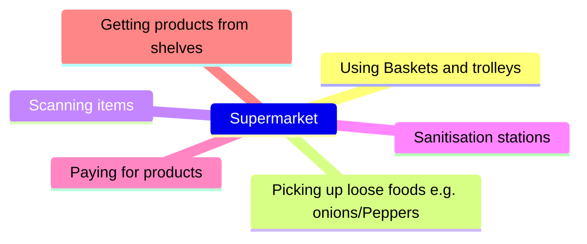

## Design brief: "Remove the hand as an interface from a common everyday task" 

## My teams focus remained around a supermarket. 

### Here is a range of concept ideas: 

  
  

  
  

  
  

### Concept Development

### Physical exploration

#### CAD exploration

### Final design 
