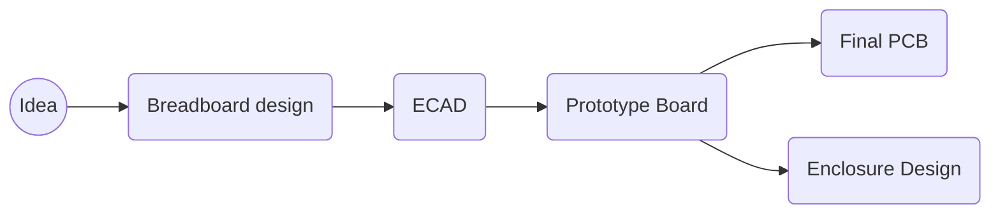

## Problem:
*Stop killing my Basil plant and to allow me to go on 1month vacations without stressing about my Herbs.*

## Solution proposed:
{: width="300" .w-50 .right}
1. Smart plant pot with auto watering feature
2. Artificial lighting to supplement UK's fantastic sunlight

## Final Prototype 

- Capacitive moisture sensor
- 1 Peristaltic pump connected to a 5L bottle
- RTC to accurately know the hour of the day to track lighting cycles
- 230v relay up to 10A to control huge range of lighting sources. 

## Methodology

## Robotics and Automation Event

During my time in Cambridge, I was invited to an informal evening dedicated to those working on or interested in robotics and automation around the Cambridge area by Makespace. The purpose was to showcase the current progress in my SmartBasil plant.

There was a diverse range of designs on display, ranging from projects by companies to personal endeavors. Examples included farming robotics and automation, autonomous vehicles, medical robots, educational robots, and even battle bots.

This event provided an opportunity to interact with a wide spectrum of talented individuals, from PhD computer science students to seasoned electronics professionals with more years of experience than I've been alive. The diverse expertise present allowed me to ask numerous questions and gather insights for the next phase of my project, which involved the development of a full-fledged professional PCB.

## Robotics and Automation Event