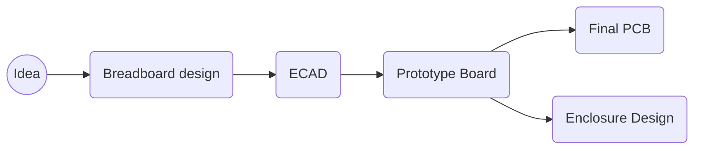

Moving to england required me to switch from my usual mediteranian diet. To combate this drastic switch I made a smart plant pot with artificial lights to keep providing me with basil all year round, no matter the British weather.

## Problem:
*My basil plants die in the winter, and have minimal growth*

## Solution proposed:
{: width="300" .w-50 .right}
1. Smart plant pot with auto watering feature
2. Artificial lighting to supplement UK's fantastic sunlight

## Final Prototype 

- Capacitive moisture sensor
- 1 Peristaltic pump connected to a 5L bottle
- RTC to accurately know the hour of the day to track lighting cycles
- 230v relay up to 10A to control huge range of lighting sources. 

## Methodology

{: width="300" .w-50 .right}
## Breadboard design 

- 12v Peristaltic pump 
- FeatherS2 
- Adafruit relay 3.3v logic
- RTC feather shield adafruit
## ECAD

<table style="width: 100%;">
  <tr>
    <td style="width: 31%; text-align: center;">
      Board layout" 
      
    </td>
    <td style="width: 50%; text-align: center;">
      3D PCB & component view 
      
    </td>
  </tr>
</table>

## Prototype Board

<table style="width: 100%;">
  <tr>
    <td style="width: 50%; text-align: center;">
      Prototype shield with FEATHERS2 
      
    </td>
    <td style="width: 50%; text-align: center;">
      Wiring underneath 
      
    </td>
  </tr>
</table>

{: width="250" .w-30 .right}

## Final PCB 
- Added in flyback protection for both 230v relay and 12v npn transistor. 
- 5v 2A usb C Power delivery
- JST connectors for both motor and soil humidity sensor 
- Latching relay to reduce power consuption, meaning only need to pulse the relay once to toggle 230v AC

## Enclosure future idea? 

# Conclusion and learnings
- First time I got a pcb manufactured. 
- Triple check your component sizes all match up, don't accept manufactures alternative components if they dont fit!
- Certain products don't need to go to pcb manufacturing. In this case I did not add any functionality by moving to a PCB. I did improve savety by ensuring the traces on the 230v can withstand 10A, much harder to do on solderd joints. 

## Robotics and Automation Event

During my time in Cambridge, I was invited to an informal evening dedicated to those working on or interested in robotics and automation around the Cambridge area by Makespace. The purpose was to showcase the current progress in my SmartBasil plant.

There was a diverse range of designs on display, ranging from projects by companies to personal endeavors. Examples included farming robotics and automation, autonomous vehicles, medical robots, educational robots, and even battle bots.

This event provided an opportunity to interact with a wide spectrum of talented individuals, from PhD computer science students to seasoned electronics professionals with more years of experience than I've been alive. The diverse expertise present allowed me to ask numerous questions and gather insights for the next phase of my project, which involved the development of a full-fledged professional PCB.
